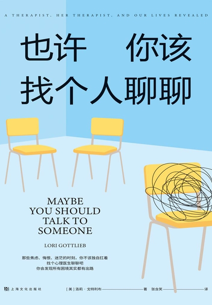
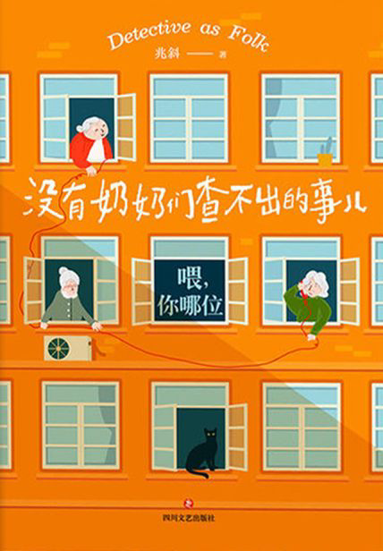
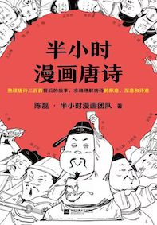

# Hi, there 👋
这里是我读过的一些书。
其中，有一些[感想很多，专门写了文章](../tags/Reading/)，还有一些短短几句，就写在了这篇文章里。
等我有时间了，会再用gallery的形式整理一下。
欢迎讨论。

# Reading
西部招妻
整理情绪的力量

# 2022
## Mar
### 也许你该找个人聊聊
作者拥有非常精彩的人生，文笔也很好。这本书有很多很幽默的地方，又有很多很触动人心的细节，让人又笑又哭的。感觉这本书的定位介于小说和散文之间，有故事有情节，也有很多实用的心理学知识。

## Feb
### 没有奶奶们查不出的事儿
蛮好玩的小说，轻悬疑，将一件事，通过不同人的对话，层层展开。感觉作者的能力差了点火候，所以留下了一个开放的结尾。
愿我们都心中有火，眼里有光！

### [蛤蟆先生去看心理医生](../reading/ha-ma-xian-sheng-qu-kan-xin-li-yi-sheng/)

## Jan
### [季羡林谈人生](../reading/ji-xian-lin-tan-ren-shen/)
### [北京口述历史·八旗子弟的世界](../reading/ba-qi-zi-di-de-shi-jie/)

# 2021
## Dec
### 半小时漫画唐诗
就是公众号文章合集，了解风流人物，领略唐诗风采。P.S. 书讲到李白就没有了
风雅颂
诗经 楚辞
国风 离骚
四言 -> 五言 -> 七言
唐朝以前，古体诗，唐朝之后，格律诗：平仄、押韵、对仗
初唐：王绩————朴实、初唐四杰（王勃、杨炯、卢照邻、骆宾王）————开拓了诗歌题材、陈子昂————复古，学习汉魏诗歌、张若虚————集大成者，《春江花月夜》孤篇盖全唐
盛唐：贺知章、张九龄、高适————边塞诗派代表，带刀诗人、王昌龄————边塞诗派代表，七绝圣手、岑参————边塞诗派代表、孟浩然————山水田园诗派代表，仕隐双失、王维————山水田园诗派代表，诗佛，仕隐双得、李白————诗仙、杜甫————诗圣
中唐：白居易、韩愈、李贺
晚唐：李商隐、杜牧、温庭筠

### [平均分](../reading/average-score/)

## Sep
### [搞定II:提升工作与生活效率的52项原则](../reading/ready-for-anything/)

## Jul
### [穷查理宝典](../reading/poor-charlies-almanack/)

# 2020
## Dec
### [我这一辈子](../reading/my-life/)

### 偷影子的人
一本温暖的小说，温馨 诙谐 充满爱和喜悦，也有淡淡的悲伤

## Nov
### She Explores
充满女性力量，书中收集分享了一些女性探险家们的经历和故事。她们的文字虽朴素，却很有力量，展示了对我来说不同寻常的她们的日常。

### 重新发电
是第九届上海双年展的记录册，也是上海当代艺术馆的建造手册。里面有很多的展品介绍，虽不能百分百体会和感受到每件展品内涵，亦大开眼界。

### 阿德勒 带队伍的12个关键法则
用一个精彩的小故事串联起了12个关键法则，浅显易懂，毫不费力地一口气看完。

## Oct
### 被讨厌的勇气
用一个青年人和哲学家的辩论来讨论阿德勒心理的一些内涵。读者就像那个青年，有自己的思考，也受传统唯物主义影响已久，对于新的概念和内容持有反对、怀疑，甚至愤怒，不停地想挑战，但最后慢慢接受了这些概念。

## Sep
### [神奇手账](../reading/journaling-and-notes-1/)
### [幸运手账 + 手帐入坑指南](../reading/journaling-and-notes-2/)
### [最强手账改造术](../reading/journaling-and-notes-3/)
### [聪明人用方格笔记本](../reading/journaling-and-notes-4/)

## Apr
### 岛上书店
shuxian先看的，我紧随其后，特别快地翻完了。读起来还是很轻松好睡的。
没有谁是一座孤岛，一书一世界。
书店是个好地方，应该没有人不喜欢。

### [南大读本-社会/自然科学卷](../reading/nju-readings-part1/)

## Mar
### [无声告白](../reading/journaling-and-notes-4/)

# 2019
## Nov
### [How to Read a Book](../reading/how-to-read-a-book/)
### [断舍离](../reading/the-life-changing-magic-of-tidying-up/)

# 2017
## Aug
### [在这个复杂世界里](../reading/in-this-complicated-world/)