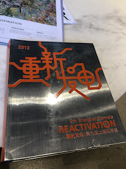
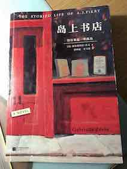

# Reading
Clean Code
穷查理宝鉴
1984
恋爱心理必修课
人类愚蠢辞典
黑客与画家
整理情绪的力量

# 2020
## Dec
### [我这一辈子](../reading/my-life/)

#### 偷影子的人
一本温暖的小说，温馨 诙谐 充满爱和喜悦，也有淡淡的悲伤

## Nov
#### She Explores
充满女性力量，书中收集分享了一些女性探险家们的经历和故事。她们的文字虽朴素，却很有力量，展示了对我来说不同寻常的她们的日常。

#### 重新发电
是第九届上海双年展的记录册，也是上海当代艺术馆的建造手册。里面有很多的展品介绍，虽不能百分百体会和感受到每件展品内涵，亦大开眼界。

#### 阿德勒 带队伍的12个关键法则
用一个精彩的小故事串联起了12个关键法则，浅显易懂，毫不费力地一口气看完。

## Oct
#### 被讨厌的勇气
用一个青年人和哲学家的辩论来讨论阿德勒心理的一些内涵。读者就像那个青年，有自己的思考，也受传统唯物主义影响已久，对于新的概念和内容持有反对、怀疑，甚至愤怒，不停地想挑战，但最后慢慢接受了这些概念。

## Sep
### [神奇手账](../reading/journaling-and-notes-1/)
### [幸运手账 + 手帐入坑指南](../reading/journaling-and-notes-2/)
### [最强手账改造术](../reading/journaling-and-notes-3/)
### [聪明人用方格笔记本](../reading/journaling-and-notes-4/)

## Apr
#### 岛上书店
shuxian先看的，我紧随其后，特别快地翻完了。读起来还是很轻松好睡的。
没有谁是一座孤岛，一书一世界。
书店是个好地方，应该没有人不喜欢。

### [南大读本-社会/自然科学卷](../reading/nju-readings-part1/)

## Mar
### [无声告白](../reading/journaling-and-notes-4/)

# 2019
## Nov
### [How to Read a Book](../reading/how-to-read-a-book/)
### [断舍离](../reading/the-life-changing-magic-of-tidying-up/)

# 2017
## Aug
### [在这个复杂世界里](../reading/in-this-complicated-world/)